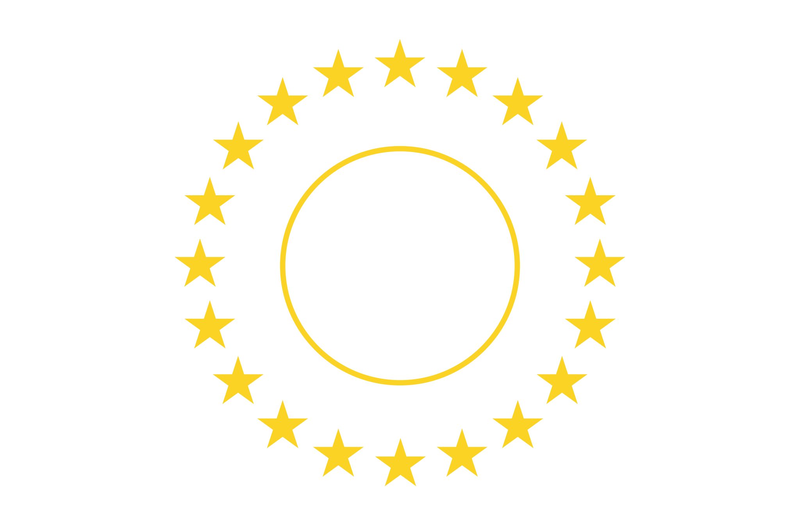
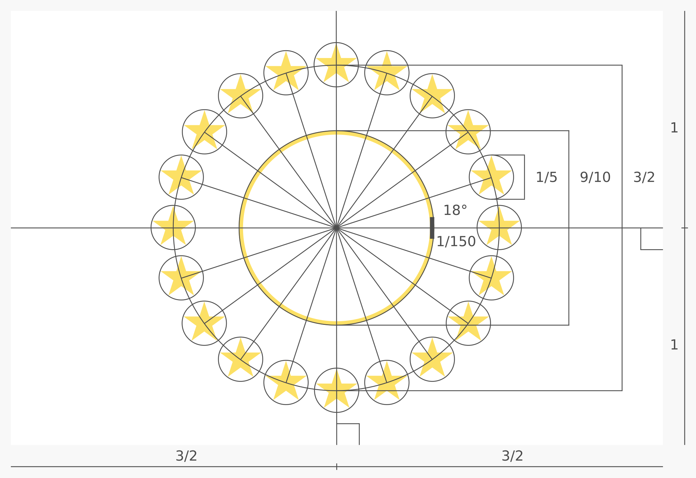
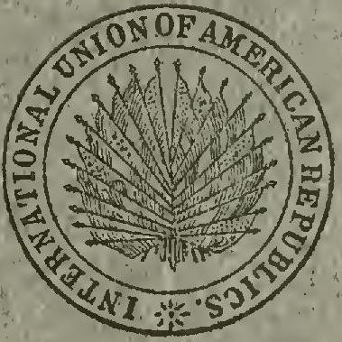

# [Flag of America](https://github.com/andrewtavis/flag-of-america)

<!-- 
 -->

### A flag for American solidarity

<strong>🌐 Other languages</strong>

- [Aymara](./READMES/README-ay.md)
- [Nederlands](./READMES/README-nl.md)
- English
- [Español](./READMES/README-es.md)
- [Français](./READMES/README-fr.md)
- [Guarani](./READMES/README-gn.md)
- [Haitian Creole](./READMES/README-ht.md)
- [Português](./READMES/README-pt.md)
- [Quechua](./READMES/README-qu.md)

The **Flag of America** is a symbolic representation of America. Its purpose is to support the unity of all Americans in their struggle towards ever greater collaboration and political integration.

> [!NOTE]
> Downloadable files for the [flag](./images/flag/), [stars symbol](/images/symbol/) and [design specification](/images/design_specification/) can be found in the [images](./images/) directory.

## **Contents**

- [Flag](#flag-)
- [Design](#design-)
  - [Symbols](#symbols-)
  - [Colors](#colors-)
- [License](#license-)

## Flag [`⇧`](#contents)

> A potential flag for the American Union

## Design [`⇧`](#contents)

The following describes the design process including the meaning behind the symbols and colors.

### Symbols [`⇧`](#contents)

Twenty gold stars are set in a circle conveying American unity, harmony and solidarity. The number of stars was chosen because of the [base-20](https://en.wikipedia.org/wiki/Vigesimal) number systems of many [Indigenous peoples of the Americas](https://en.wikipedia.org/wiki/Indigenous_peoples_of_the_Americas) including the [Maya](https://en.wikipedia.org/wiki/Maya_civilization), [Aztecs](https://en.wikipedia.org/wiki/Aztecs), [Inuit](https://en.wikipedia.org/wiki/Inuit) and [Yupik](https://en.wikipedia.org/wiki/Yupik_peoples). Within the stars is a circle representing [Pan-Americanism](https://en.wikipedia.org/wiki/Pan-Americanism) as it signifies the outer boarder of the emblems used by the movement (see example below).

> Emblem of the International Union of American Republics from 1909 ([source](<https://commons.wikimedia.org/wiki/File:%22International_Union_of_American_Republics%22_logo_in_1909_-_from_publication_Cacao_(1909)_(IA_cacao00inte)_(page_1_crop).jpg>))

### Colors [`⇧`](#contents)

A circle of gold (yellow) stars brings consistency with the [European Union](https://en.wikipedia.org/wiki/European_Union) and [African Union](https://en.wikipedia.org/wiki/African_Union) flags to connect the democratic goals of these [supranational unions](https://en.wikipedia.org/wiki/Supranational_union). White was chosen for the base color as all [American nations](https://en.wikipedia.org/wiki/List_of_sovereign_states_and_dependent_territories_in_the_Americas) have either white or yellow on their flag. The hexadecimal color code for the gold is `#FBD324` from the border of the [emblem](https://en.wikipedia.org/wiki/Flag_of_the_Organization_of_American_States) of the [Organization of American States](https://en.wikipedia.org/wiki/Organization_of_American_States).

## License [`⇧`](#contents)

This work is published under the [Creative Commons 0](https://creativecommons.org/share-your-work/public-domain/cc0/) license meaning that it is fully in the [public domain](https://en.wikipedia.org/wiki/Public_domain). Others may freely build upon, enhance and reuse this work for any purposes without restriction under copyright law.
