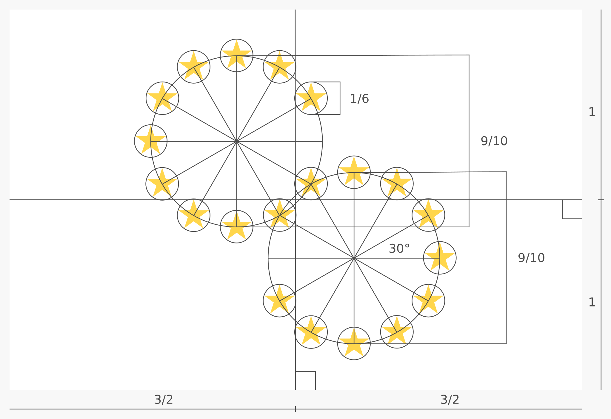

# [Flag of America](https://github.com/andrewtavis/flag-of-america)

<!-- 
 -->

### A flag for American solidarity

The **Flag of America** is a symbolic representation of the [Americas](https://en.wikipedia.org/wiki/Americas). Its purpose is to support the unity of all Americans in their struggle towards ever greater collaboration and political integration.

> [!NOTE]
> Downloadable files for the [flag](./flag_of_america/flag/), [stars symbol](./flag_of_america/symbol/) and [design specification](./flag_of_america/design_specification/) can be found in the [flag_of_america](./flag_of_america/) directory.
>
> These files are also available on Wikimedia Commons: [flag](https://commons.wikimedia.org/wiki/File:Flag_of_America.svg), [stars symbol](https://commons.wikimedia.org/wiki/File:Flag_of_America_Symbol.svg) and [design specification](https://commons.wikimedia.org/wiki/File:Flag_of_America_Design_Specification.svg).

## **Contents**

- [Flag](#flag-)
- [Design](#design-)
  - [Symbolism](#symbolism-)
  - [Colors](#colors-)
- [License](#license-)

## Flag [`⇧`](#contents)

[See the flag waving 🏳️](https://krikienoid.github.io/flagwaver/#?src=https%3A%2F%2Fupload.wikimedia.org%2Fwikipedia%2Fcommons%2Fd%2Fd9%2FFlag_of_America.svg&background=blue-sky)

  

 

> A potential flag for the American Union

## Design [`⇧`](#contents)

The following describes the design process including the meaning behind the symbols and colors.

 

  

 

> The design specification detailing all ratios and principles used

### Symbolism [`⇧`](#contents)

Twenty gold stars are set in a design conveying American unity, harmony and solidarity. The stars are arranged in a shape that resembles an outline of the [Americas](https://en.wikipedia.org/wiki/Americas) as well as a chain link. The chain link is "unfinished and broken" to represent the potential of a unified America and the power of its social movements.

The number of stars was chosen in reference to the systems of mathematics and astronomy of [Indigenous peoples of the Americas](https://en.wikipedia.org/wiki/Indigenous_peoples_of_the_Americas). These include the [base-20](https://en.wikipedia.org/wiki/Vigesimal) numeral systems of many peoples including the [Mayans](https://en.wikipedia.org/wiki/Maya_civilization), [Aztecs](https://en.wikipedia.org/wiki/Aztecs), [Inuit](https://en.wikipedia.org/wiki/Inuit), [Yupik](https://en.wikipedia.org/wiki/Yupik_peoples) and [Muisca](https://en.wikipedia.org/wiki/Muisca); the [innovative arithmetic tools](https://en.wikipedia.org/wiki/Mathematics_of_the_Incas) used like those of the [Inca](https://en.wikipedia.org/wiki/Inca_Empire); and the advanced calendar systems developed throughout the Americas.

 

  

 

> The symbol of the Flag of America

### Colors [`⇧`](#contents)

The use of gold (yellow) stars brings consistency with the [European Union](https://en.wikipedia.org/wiki/European_Union) and [African Union](https://en.wikipedia.org/wiki/African_Union) flags to connect the democratic goals of these [supranational unions](https://en.wikipedia.org/wiki/Supranational_union). White was chosen for the base color as all [American nations](https://en.wikipedia.org/wiki/List_of_sovereign_states_and_dependent_territories_in_the_Americas) have either white or yellow on their flag. The hexadecimal color code for the gold is `#FFCC00`.

## License [`⇧`](#contents)

This work is published under the [Creative Commons 0](https://creativecommons.org/share-your-work/public-domain/cc0/) license meaning that it is fully in the [public domain](https://en.wikipedia.org/wiki/Public_domain). Others may freely build upon, enhance and reuse this work for any purposes without restriction under copyright law.
