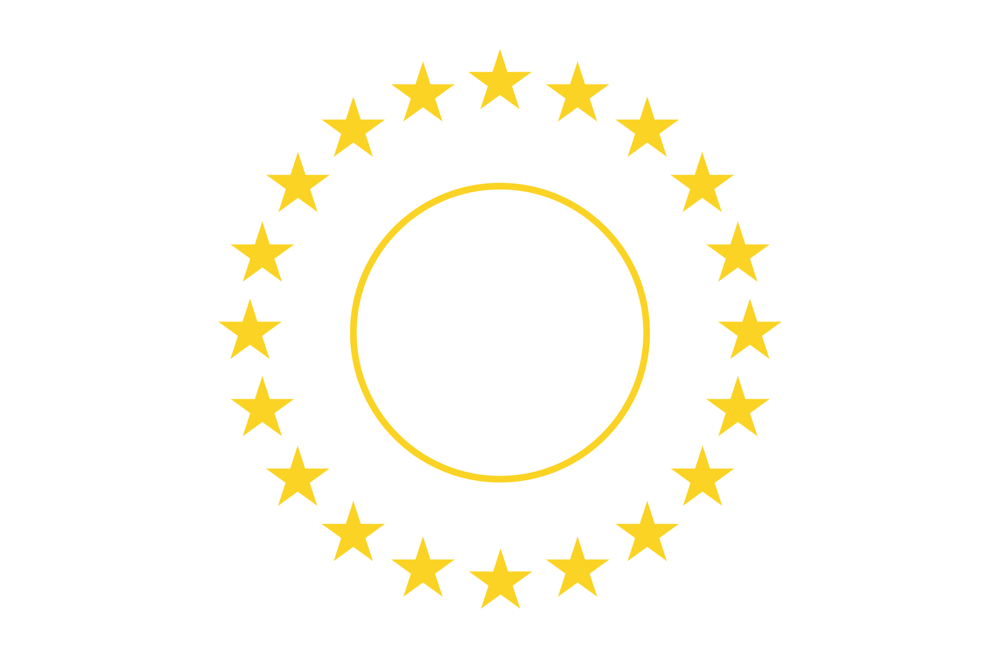
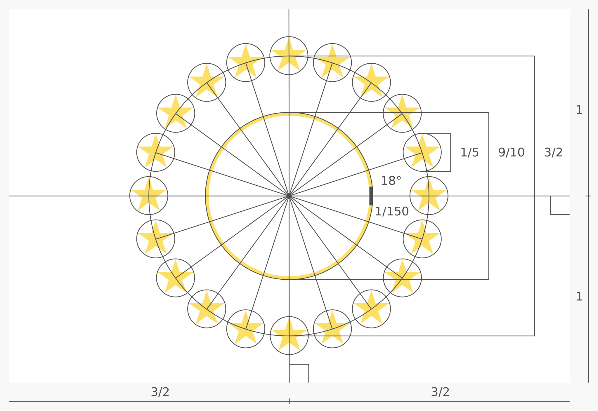

# [Flag of America](https://github.com/andrewtavis/blob/main/READMES/README-ay.md)

> [!IMPORTANT]
> This readme file is in need of localization. Pull requests are welcome! Please use articles from the Wikipedia for the given language if possible, or English Wikipedia if the page isn't available.

<!-- 
 -->

### A flag for...

<strong>🌐 Other languages</strong>

- Aymara
- [Nederlands](./README-nl.md)
- [English](../README.md)
- [Español](./README-es.md)
- [Français](./README-fr.md)
- [Guarani](./README-gn.md)
- [Haitian Creole](./README-ht.md)
- [Português](./README-pt.md)
- [Quechua](./README-qu.md)

The **Flag of America** is...

> [!NOTE]
> Downloadable files...

## **Contents**

- [Flag](#flag-)
- [Design](#design-)
  - [Symbols](#symbols-)
  - [Colors](#colors-)
- [License](#license-)

## Flag [`⇧`](#contents)

> A potential flag...

## Design [`⇧`](#contents)

The following describes...

> The design specification...

### Symbols [`⇧`](#contents)

Twenty gold stars...

   
    
    &nbsp;&nbsp;&nbsp;&nbsp;&nbsp;&nbsp;&nbsp;&nbsp;&nbsp;
    
   

> Emblem of the...
>
> Emblem source: [Wikimedia Commons](<https://commons.wikimedia.org/wiki/File:%22International_Union_of_American_Republics%22_logo_in_1909_-_from_publication_Cacao_(1909)_(IA_cacao00inte)_(page_1_crop).jpg>)

### Colors [`⇧`](#contents)

A circle of gold...

## License [`⇧`](#contents)

This work is...
